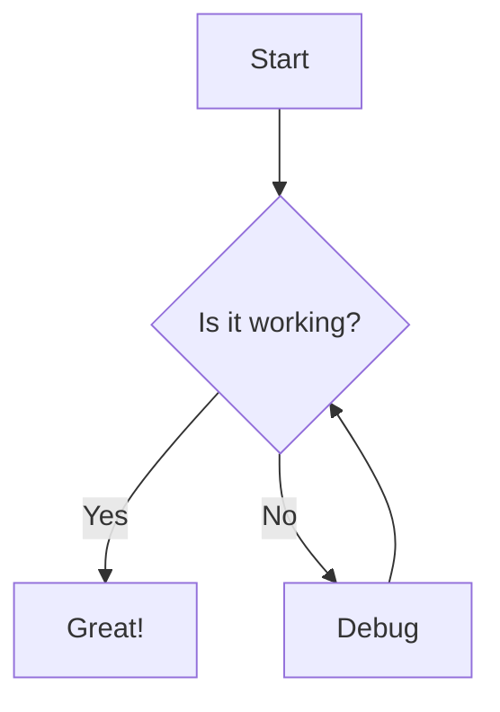
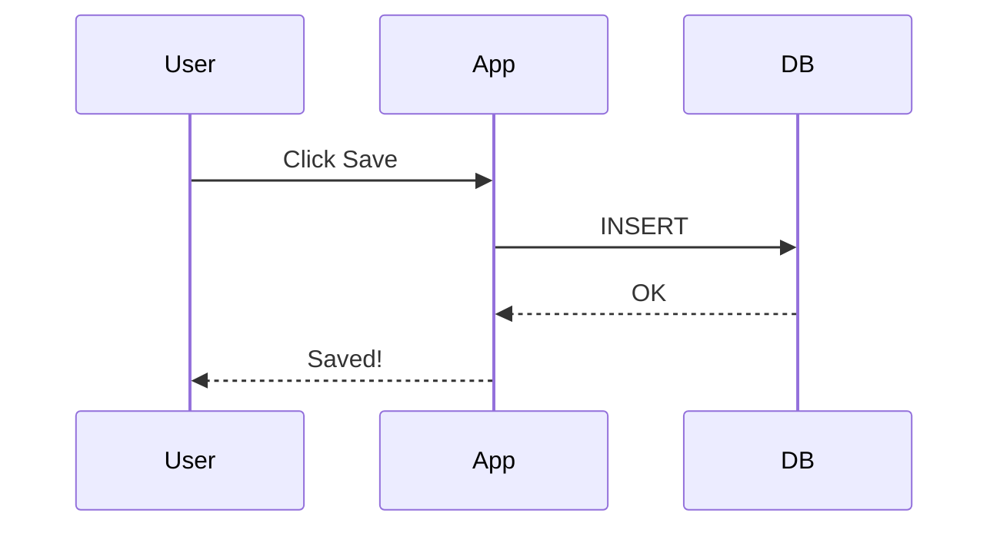
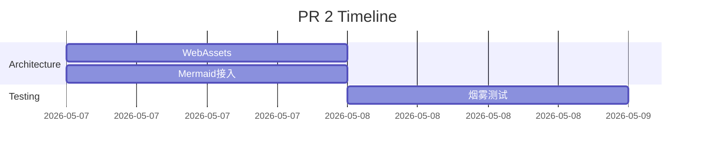
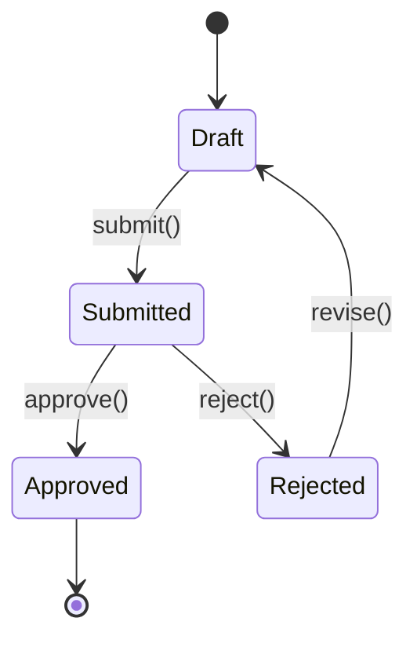
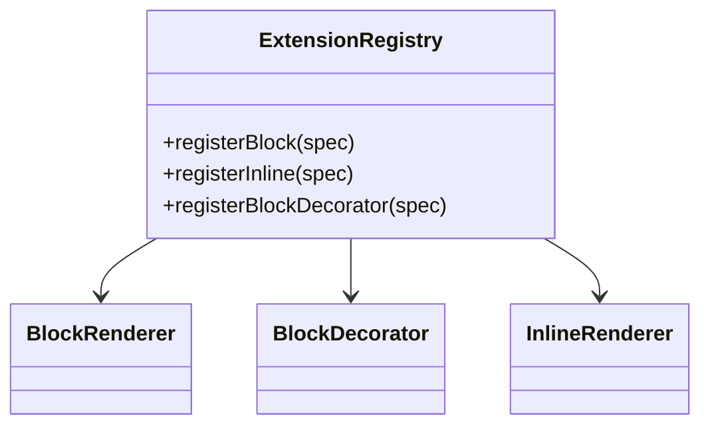
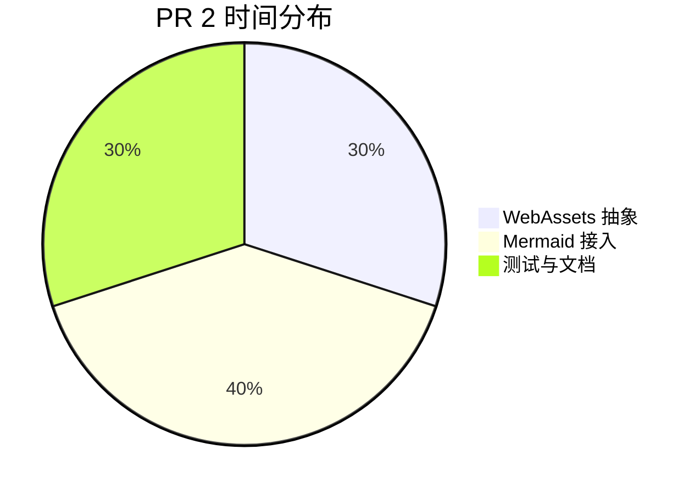

# Mermaid Smoke Test

> 用于每次更新 mermaid.min.js 版本后验证。打开此文件，确认每个图都正常渲染。
> 任意一个图没渲染或显示错误 → 检查 Mermaid changelog 看是否 breaking change。

---

## 1. Flowchart（最基本）



---

## 2. Sequence Diagram



---

## 3. Gantt Chart



---

## 4. State Diagram



---

## 5. Class Diagram



---

## 6. Pie Chart



---

## 7. 故意的语法错（应显示 syntax error，不是 runtime error）

```mermaid
graph TD
  A[Start --> B
  此处缺少右方括号
```

期望：黄色（syntax）错误框，不是红色（runtime）错误框。

---

## 8. 主题切换测试

切换 macOS 系统主题（System Settings → Appearance → Dark/Light），
上面所有图表应该立即重新渲染为对应主题色。
